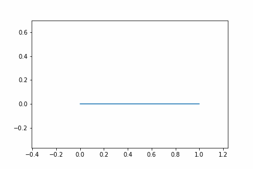

# Fractals

Constructs IFS fractals in python.
Plots fractals in the complex plane.

## Installation
Clone the repo  
If you want, you can install the Gif package for gif creation 
There are now docstrings! You will want to look at the source code (Sorry!)

## The Docstrings
Will tell you to read about the fractal on Larry Riddle's Website,
If you have questions on implementation, you will want to look at the source code

A DragonFractal can be used if your functions don't create a single line

BinaryTree can be used to create [Binary trees](https://larryriddle.agnesscott.org/ifs/pythagorean/symbinarytree.htm)

## Contrubuting

Feel Free to contribute.

## TODO
- [ ] Finish Docstrings for last few Classes
- [ ] Create a UI
- [ ] Create a function creator UI
- [ ] Make animated Iterative fractals